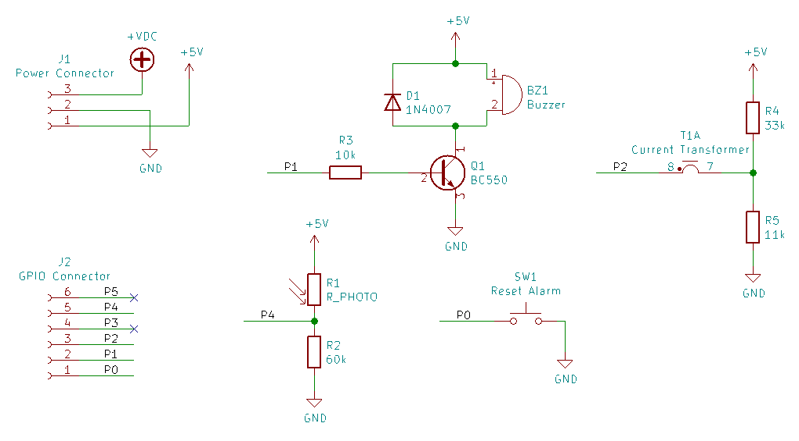
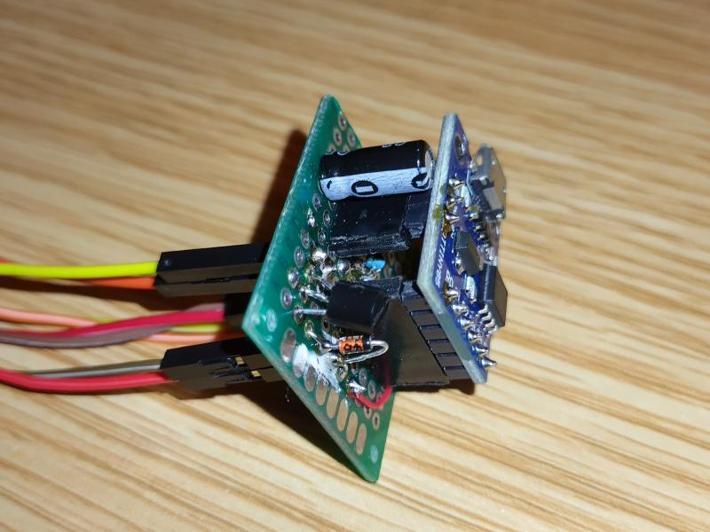
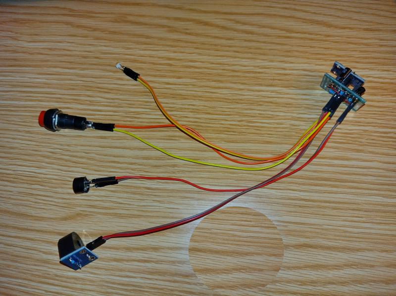

## Pump station alarm

#### Motivation
I have sewage pumping stations. Unfortunately, it does not have an additional protection system against overfilling the tank in the event of the floats getting stuck. I cannot modify the automatics of the device, so I designed a alarm device which periodically performs a current measurement.

#### Idea
Ihe idea is based on measuring the current of the pump motor. I know from observations that the pump turns on on average once a day, at least once every two days.  
The alarm device has a timer after which expiration an acoustic alarm will be triggered. If the device registers the current, the counter is reset. Counter is cleared periodically by the motor of the normal working pump.

Additionally, in order not to manually switch off the monitoring device in the case of family trips when the pump station is not used, an additional activation feature was designed. It is implemented as an analog input to which a photoresistor is connected. The level of light intensity in the hall is monitored. If there are people in the house, the light is turned on at least once a day.  
A photoresistor can be bridged if the alarm device should be always active.

##### Additional features 

- Acoustic current presentation - measured current level is presented by fast beeps sequence. A scale is one beep per 1A. This functionality is disabled by default. To enable hold pressed a reset button during startup until three fast beeps. Without that only two beeps are emitted and the feature is disable.

- Safe power off - it is signalisation of incidental supply voltage lack. After detection it is emitted beep per 0.5s until reset it by the reset button. There is always need have pressed the reset button during safe powering off the device, then device starts work without this acoustic signal. I had a problem with broken power supply and lacks of powering voltage periodically which reset the timer of alarm.  
To enable this featire hold pressed a reset button during 2s just after the acoustic sygnal of the acoustic current presentation feature. Switching to enable is signaled by two beeps and switching to disable by one beeps.

- Heart beat - acoustic signalisation of normal working of the device. A beep is emitted every 20s.

#### User manual (Polish)

Instrukcja obslugi w jezyku polskim jest w [pliku pdf](Alarm_pompy.pdf).

#### Hardware

Digispark clone with ATTinny85. Programming via USB with use [micronucleus](https://github.com/micronucleus/micronucleus).

KiCad schema is in [this file](connections.sch), so you can design  PCB if you want .

The prototype was mounted on a universal board attached to the digispark pins.  

  

